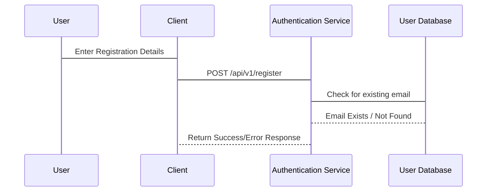
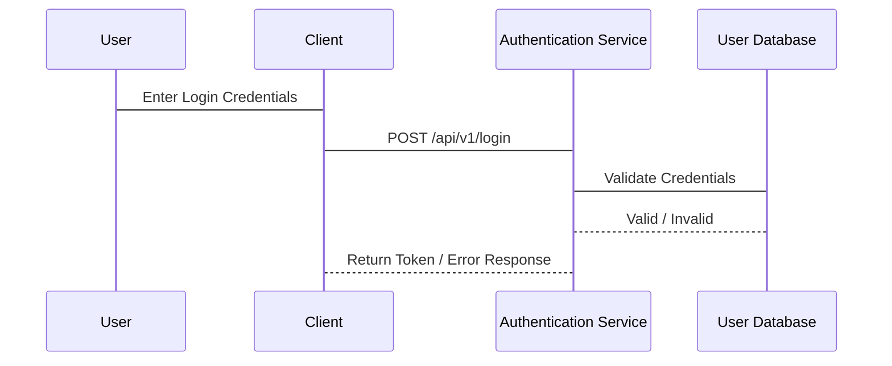
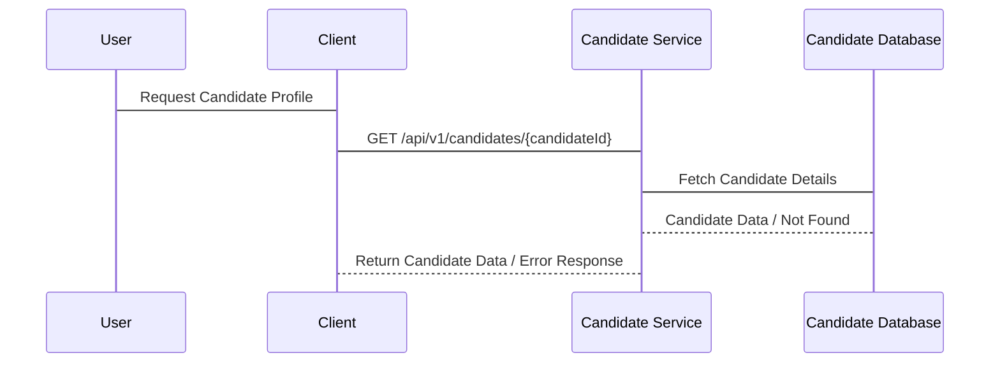
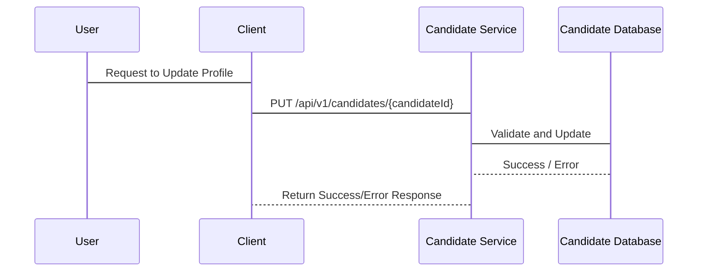
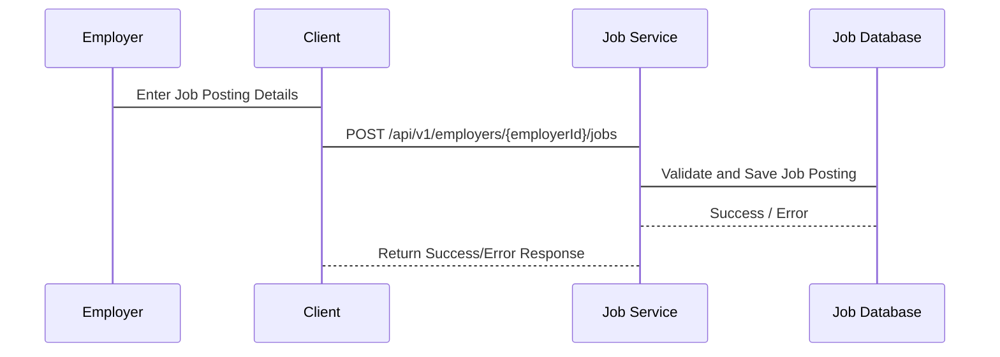
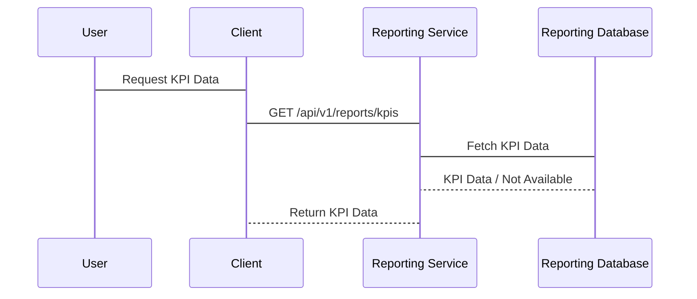

Here’s a comprehensive list of all APIs categorized by component, along with their index, response, issues, characteristics, use cases, failover strategies, resolutions, components involved, and sequence diagrams for each component.

### API Index

1. **User Authentication APIs**
   - 1.1 User Registration API
   - 1.2 User Login API

2. **Candidate Management APIs**
   - 2.1 Candidate Profile API
   - 2.2 Update Candidate Profile API

3. **Employer Management APIs**
   - 3.1 Job Posting API

4. **DEI Consultant APIs**
   - 4.1 Interview Shadowing API

5. **Analytics and Reporting APIs**
   - 5.1 KPI Tracking API

6. **Compliance and Security APIs**
   - 6.1 GDPR Compliance API

---

### 1. User Authentication APIs

#### 1.1 User Registration API
- **Index**: 1.1
- **Endpoint**: `POST /api/v1/register`
- **Response**: 
  - Success: `{ "message": "Registration successful", "userId": "12345" }`
  - Error: `{ "error": "Email already exists" }`
- **Issues**:
  - Email already exists.
  - Invalid input format.
  - Server errors during processing.
- **Characteristics**:
  - Stateless.
  - Input validation required.
  - Returns JWT for session management.
- **Use Cases**: Register new users (Candidates, Employers, DEI Consultants).
- **Failover**: Retry registration on server error.
- **Resolution**: Suggest users to correct input errors or use a different email.
- **Components Involved**: 
  - Frontend (Client-side application)
  - Backend (Authentication Service)
  - Database (User Database)
- **Sequence Diagram**:
```
sequenceDiagram
  User -> Client: Enter Registration Details
  Client -> Authentication Service: POST /api/v1/register
  Authentication Service -> User Database: Check for existing email
  User Database --> Authentication Service: Email Exists / Not Found
  Authentication Service --> Client: Return Success/Error Response
```



---

#### 1.2 User Login API
- **Index**: 1.2
- **Endpoint**: `POST /api/v1/login`
- **Response**: 
  - Success: `{ "token": "jwt_token_here", "userId": "12345" }`
  - Error: `{ "error": "Invalid credentials" }`
- **Issues**:
  - Invalid credentials.
  - Token expiration.
  - Account locked due to multiple failed attempts.
- **Characteristics**:
  - Stateless.
  - Uses JWT for session management.
- **Use Cases**: Authenticate users to access the platform.
- **Failover**: Provide password reset option if login fails.
- **Resolution**: Prompt user for correct credentials or offer to reset password.
- **Components Involved**:
  - Frontend (Client-side application)
  - Backend (Authentication Service)
  - Database (User Database)
- **Sequence Diagram**:
```sequenceDiagram
  User -> Client: Enter Login Credentials
  Client -> Authentication Service: POST /api/v1/login
  Authentication Service -> User Database: Validate Credentials
  User Database --> Authentication Service: Valid / Invalid
  Authentication Service --> Client: Return Token / Error Response
```



---

### 2. Candidate Management APIs

#### 2.1 Candidate Profile API
- **Index**: 2.1
- **Endpoint**: `GET /api/v1/candidates/{candidateId}`
- **Response**: 
  - Success: `{ "candidateId": "12345", "name": "John Doe", "skills": ["Java", "Python"] }`
  - Error: `{ "error": "Candidate not found" }`
- **Issues**:
  - Candidate not found.
  - Insufficient permissions.
- **Characteristics**:
  - Secure access with role-based permissions.
- **Use Cases**: Retrieve details of a specific candidate.
- **Failover**: Cache candidate profiles for faster retrieval.
- **Resolution**: Inform user if candidate is not found or if they lack access.
- **Components Involved**:
  - Frontend (Client-side application)
  - Backend (Candidate Service)
  - Database (Candidate Database)
- **Sequence Diagram**:
```sequenceDiagram
  User -> Client: Request Candidate Profile
  Client -> Candidate Service: GET /api/v1/candidates/{candidateId}
  Candidate Service -> Candidate Database: Fetch Candidate Details
  Candidate Database --> Candidate Service: Candidate Data / Not Found
  Candidate Service --> Client: Return Candidate Data / Error Response
```


---

#### 2.2 Update Candidate Profile API
- **Index**: 2.2
- **Endpoint**: `PUT /api/v1/candidates/{candidateId}`
- **Response**: 
  - Success: `{ "message": "Candidate profile updated successfully" }`
  - Error: `{ "error": "Unauthorized access" }`
- **Issues**:
  - Unauthorized access.
  - Validation errors.
- **Characteristics**:
  - Role-based access control.
  - Input validation required.
- **Use Cases**: Update candidate profiles.
- **Failover**: Keep original profile data until update is confirmed.
- **Resolution**: Provide feedback on what failed in the update.
- **Components Involved**:
  - Frontend (Client-side application)
  - Backend (Candidate Service)
  - Database (Candidate Database)
- **Sequence Diagram**:


---

### 3. Employer Management APIs

#### 3.1 Job Posting API
- **Index**: 3.1
- **Endpoint**: `POST /api/v1/employers/{employerId}/jobs`
- **Response**: 
  - Success: `{ "message": "Job posted successfully", "jobId": "67890" }`
  - Error: `{ "error": "Unauthorized access" }`
- **Issues**:
  - Unauthorized access.
  - Validation errors in job details.
- **Characteristics**:
  - Secure with role validation.
- **Use Cases**: Allow employers to post job openings.
- **Failover**: Queue job postings if the service is down.
- **Resolution**: Provide feedback on the posting failure and required corrections.
- **Components Involved**:
  - Frontend (Client-side application)
  - Backend (Job Service)
  - Database (Job Database)
- **Sequence Diagram**:


---

### 4. DEI Consultant APIs

#### 4.1 Interview Shadowing API
- **Index**: 4.1
- **Endpoint**: `POST /api/v1/dei-consultants/{consultantId}/shadow`
- **Response**: 
  - Success: `{ "message": "Shadowing scheduled successfully" }`
  - Error: `{ "error": "Conflict in scheduling" }`
- **Issues**:
  - Scheduling conflicts.
  - Insufficient permissions.
- **Characteristics**:
  - Requires detailed scheduling parameters.
- **Use Cases**: Schedule interviews for DEI consultants to shadow.
- **Failover**: Notify users for rescheduling if conflicts occur.
- **Resolution**: Provide alternative time slots for shadowing.
- **Components Involved**:
  - Frontend (Client-side application)
  - Backend (DEI Service)
  - Database (Scheduling Database)
- **Sequence Diagram**:
  ```sequenceDiagram
  Consultant -> Client: Request to Schedule Shadowing
  Client -> DEI Service: POST /api/v1/dei-consultants/{consultantId}/shadow
  DEI Service -> Scheduling Database: Check Availability
  Scheduling Database --> DEI Service: Available / Conflict
  DEI Service --> Client: Return Success/Error Response
  ```
    ```mermaid
    sequenceDiagram
  Consultant -> Client: Request to Schedule Shadowing
  Client -> DEI Service: POST /api/v1/dei-consultants/{consultantId}/shadow
  DEI Service -> Scheduling Database: Check Availability
  Scheduling Database --> DEI Service: Available / Conflict
  DEI Service --> Client: Return Success/Error Response
  ```
---

### 5. Analytics and Reporting APIs

#### 5.1 KPI Tracking API
- **Index**: 5.1
- **Endpoint**: `GET /api/v1/reports/kpis`
- **Response**: 
  - Success: `{ "kpis": { "totalCandidates": 150, "totalJobs": 50 } }`
  - Error: `{ "error": "Data not available" }`
- **Issues**:
  - Data unavailability.
- **Characteristics**:
  - Aggregates data from multiple sources.
- **Use Cases**: Provide insights on platform performance metrics.
- **Failover**: Cache previous KPI data for quick retrieval.
- **Resolution**: Inform users of data unavailability and provide a recovery timeline.
- **Components Involved**:
  - Frontend (Client-side application)
  - Backend (Reporting Service)
  - Database (Reporting Database)
- **Sequence Diagram**:

